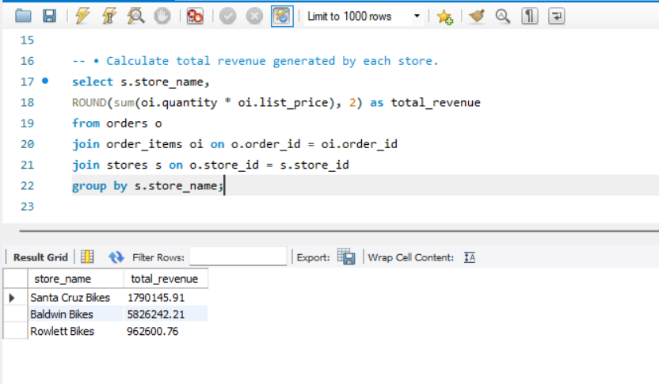
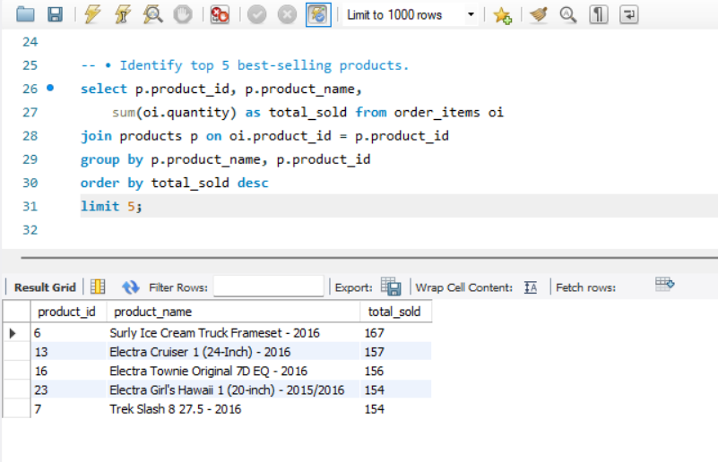
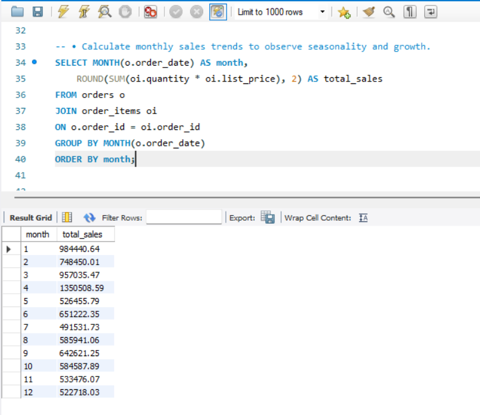
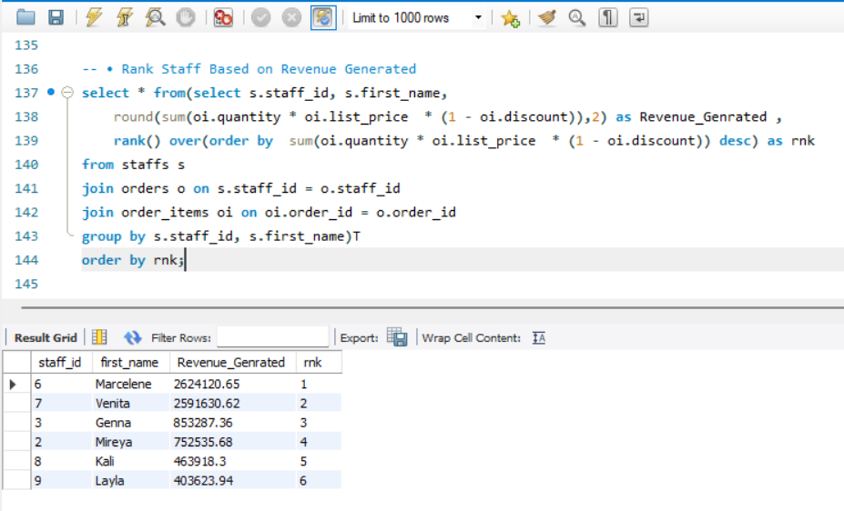

# Store Sales SQL Analysis

This project analyzes store sales data using SQL and MySQL Workbench.

## Features
- Sales Analysis
- Customer Analysis
- Inventory Management
- Employee Performance Analysis

## Tools Used
- SQL
- MySQL Workbench
- Excel

## Files Included
- SQL Queries
- PPT Presentation
- ER Diagram
- Dataset
- BRD Documents

## Project Screenshots

### Store Revenue Analysis

### Top Selling Products

### Monthly Sales Trends

### Staff Revenue Ranking

